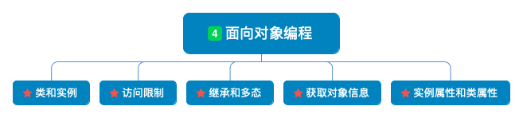

# 面向对象编程


    

### 1. 类和实例

面向对象最重要的概念就是类（Class）和实例（Instance），<font color=red>类是抽象的模板， 实例是根据类创建出来的一个个具体的“对象”</font>

在python中，用变量表示特征，用函数表示技能，因而具有相同特征和技能的一类事物就是‘类’，对象是则是这一类事物中具体的一个。

- 类(Class): 用来描述具有相同的属性和方法的对象的集合。它定义了该集合中每个对象所共有的属性和方法。对象是类的实例。
- 类变量：类变量在整个实例化的对象中是公用的。类变量定义在类中且在函数体之外。类变量通常不作为实例变量使用。
- 数据成员：类变量或者实例变量, 用于处理类及其实例对象的相关的数据。
- 方法重写：如果从父类继承的方法不能满足子类的需求，可以对其进行改写，这个过程叫方法的覆盖（override），也称为方法的重写。
- 局部变量：定义在方法中的变量，只作用于当前实例的类。
- 实例变量：在类的声明中，属性是用变量来表示的。这种变量就称为实例变量，是在类声明的内部但是在类的其他成员方法之外声明的。
- 继承：即一个派生类（derived class）继承基类（base class）的字段和方法。继承也允许把一个派生类的对象作为一个基类对象对待。例如，有这样一个设计：一个Dog类型的对象派生自Animal类，这是模拟"是一个（is-a）"关系（例图，Dog是一个Animal）。
- 实例化：创建一个类的实例，类的具体对象。
- 方法：类中定义的函数。
- 对象：通过类定义的数据结构实例。对象包括两个数据成员（类变量和实例变量）和方法。

> 使用class语句创建一个新类，class之后为类的名称并以冒号结尾

```
>>> class Student:
...     pass
... 
>>> bart = Student()
>>> bart
<__main__.Student object at 0x10fe359b0>
>>> Student
<class '__main__.Student'>
```

举例[student.py](student.py)

### 2. 访问限制

 * 要让内部属性不被外部访问，可以把属性的名称前加上两个下划线"\__"，在Python中，实例的变量名如果以"__"开头，就变成了一个私有变量（private），只有内部可以访问，外部不能访问
 <br/>
 * 在Python中，变量名类似__xxx__的，也就是以双下划线开头，并且以双下划线结尾的，是特殊变量，特殊变量是可以直接访问的，不是private变量，所以，不能用__name__、__score__这样的变量名。

 在[student.py](student.py)添加了私有变量gender
