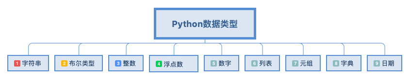

# Python数据类型



### 1.字符串
##### 1.1 使用单引号
用单引号括起来表示字符串，例如：
` str = 'this is python-note' `
##### 1.2 使用双引号
双引号中的字符串与单引号中的字符串用法完全相同，例如：
` str = "this is python-note" `
##### 1.3 使用三引号
利用三引号，表示多行的字符串，可以在三引号中自由的使用单引号和双引号，例如：
```
str='''this is string
this is pythod string
this is string'''
```
##### 1.4 转义字符 '\\'

转义字符 \ 可以转义很多字符，比如\n表示换行，\t表示制表符，字符\本身也要转义，所以\\表示的字符就是\

Python还允许用r''表示''内部的字符串默认不转义

### 2.布尔类型